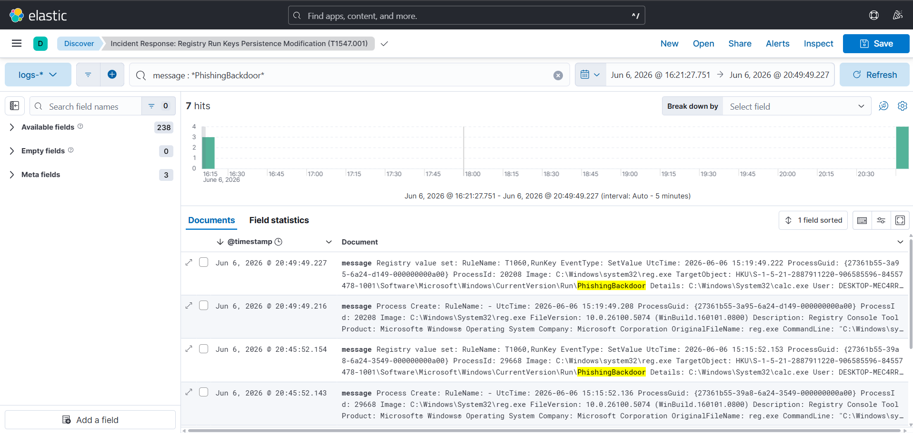

# Module 02: Startup Registry Persistence Modification (MITRE ATT&CK T1547.001)

## 1. Technical Attack Simulation
* **Adversary Objective:** Hijacking native operating system boot sequences to establish a permanent backdoor that automatically reconnects even if the user logs out or reboots the workstation.
* **Execution Command:**
    ```powershell
    reg add "HKEY_CURRENT_USER\Software\Microsoft\Windows\CurrentVersion\Run" /v "PhishingBackdoor" /t REG_SZ /d "C:\Windows\System32\calc.exe" /f
    ```

---

## 2. Incident Response Playbook

### 🛠️ Phase 1: Detection & Analysis
* **SIEM Threat Hunting Query (KQL):**
    ```text
    message : *PhishingBackdoor*
    ```
* **Telemetry Verification:** Look for a high-severity indicator flag on your dedicated persistence monitoring dashboard.
* **Forensic Parsing:** Traditional security logs regularly miss direct database registry tampering. Inspect your expanded data view to verify **Sysmon Event ID 13 (RegistryValueName Set)**. Validate that the `winlog.event_data.TargetObject` points directly to the `...\CurrentVersion\Run` key hive and ensure the `Details` field exposes the unauthorized payload path string (`calc.exe`).

### 🛡️ Phase 2: Containment
* **Host Network Segregation:** Immediately isolate the compromised host computer (`DESKTOP-MFC4RRM`) from the local network infrastructure to prevent active backdoor callback loops.
* **CRITICAL OPERATIONAL CONSTRAINT:** **Do not restart or reboot the host machine during containment.** Rebooting will trigger the OS to parse the registry run list, actively launching the hidden backdoor payload executable into system memory.

### 🧹 Phase 3: Eradication
* **Registry Remediation:** Run this administrative command to manually purge the unauthorized backdoor key from the operating system's startup configuration loop:
    ```powershell
    reg delete "HKEY_CURRENT_USER\Software\Microsoft\Windows\CurrentVersion\Run" /v "PhishingBackdoor" /f
    ```
* **Payload Invalidation:** Navigate to the path uncovered in the log's `Details` field and permanently delete or quarantine any rogue binaries tied to that execution key.

### 📝 Phase 4: Lessons Learned & System Hardening
* **Enforce Registry Access Control:** Modify Active Directory Group Policy Objects (GPOs) or registry ACLs to strictly prevent local standard user accounts from modifying auto-run registry pathways without explicit multi-factor administrative credential elevation.
* **Active Defense Automation:** Integrate active-response scripts within the enterprise SIEM network so that an endpoint is automatically quarantined from the local area network the precise millisecond a registry persistence modification indicator drops.

---

## 🖼️ Forensic Artifact Evidence

